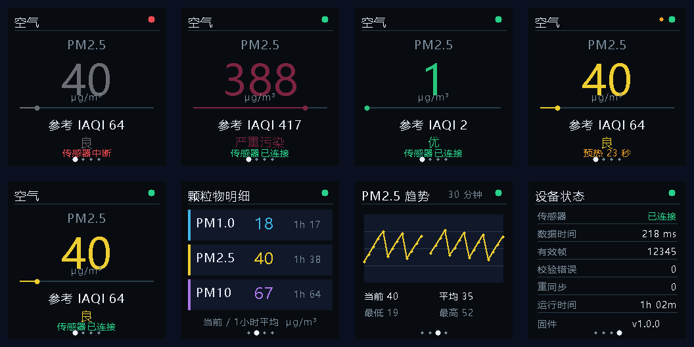
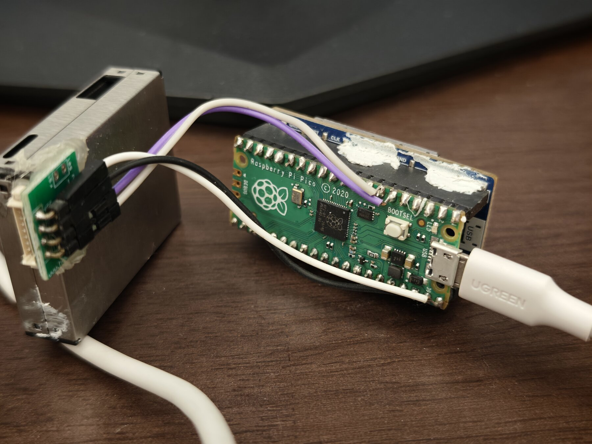
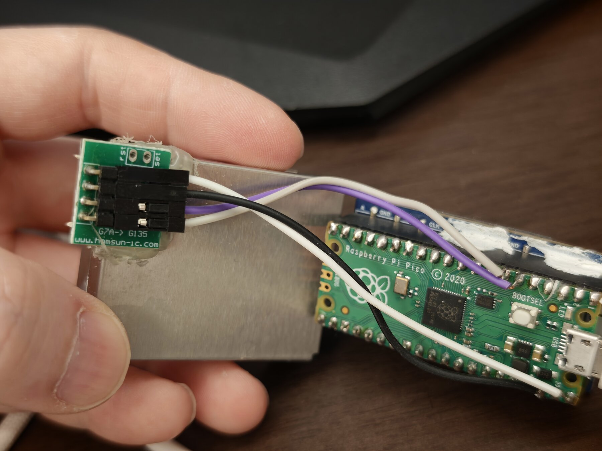

# Pico PM2.5 显示器

面向 Raspberry Pi Pico（RP2040）、Waveshare Pico-LCD-1.3 和 Plantower
PMS7003 的桌面空气颗粒物显示固件。固件持续采集 PMS7003 的大气环境数据，
在 240×240 IPS 屏幕上提供实时读数、明细、趋势和诊断四个页面。

[下载最新 UF2](https://github.com/derekhe/pico-pm2.5/releases/latest) · Pico SDK 2.3.1 · C++17 · HJ 633—2026



## 主要功能

- 首页、颗粒物明细、10/30/60 分钟趋势和设备状态四个中文页面。
- PMS7003 流式解析、校验、断帧与噪声重同步，以及 3 秒断线自动恢复。
- 最近 5 个有效样本中位数、一小时分钟均值和 HJ 633—2026 参考 IAQI。
- 单 RGB565 帧缓冲、SPI1 DMA 刷屏、PWM 背光与完整板载按键支持。
- USB CDC 每秒诊断输出；传感器 UART 引脚自动探测并锁定。

## 接线

Pico-LCD-1.3 直接插在 Pico 排针上，方向以屏幕和 Pico 的 USB 丝印同侧为准。
PMS7003 转接板接线如下：

| PMS7003 | Raspberry Pi Pico | 说明 |
|---|---|---|
| VCC | VSYS | USB 供电时约 5V，不能接 3V3 |
| GND | GND | 共地 |
| RX | GP4 / UART1 TX | 照片中现有接线；Pico 向传感器发送命令 |
| TX | GP5 / UART1 RX | 照片中现有接线；传感器向 Pico 输出数据 |

固件同时探测 GP4/GP5 和 GP0/GP1，收到首个校验正确的 PMS7003 帧后自动锁定，
因此也兼容 `RX → GP0`、`TX → GP1` 的接法。PMS7003 风扇需要 4.5–5.5V；
UART 数据脚使用 3.3V 逻辑。不要把 Pico GPIO 直接接到 5V 逻辑信号。

<p>
  
  
</p>

## 页面与按键

- 首页：PM2.5 大号读数、滚动一小时参考 IAQI、空气等级和连接状态。
- 明细：PM1.0、PM2.5、PM10 当前值与一小时平均值。
- 趋势：最近 10、30 或 60 分钟 PM2.5 分钟均值。
- 状态：数据年龄、有效帧、校验错误、重同步、运行时间和版本。

| 操作 | 功能 |
|---|---|
| 摇杆左 / A | 上一页 |
| 摇杆右 / B | 下一页 |
| 摇杆上 / 下 | 调整背光（20%、40%、60%、80%、100%） |
| 摇杆中键 | 返回首页 |
| X | 趋势页切换 10/30/60 分钟范围 |
| Y | 关闭背光；任意键仅唤醒屏幕 |

开机或长时间断线恢复后有 30 秒预热期。屏幕关闭时传感器和趋势采集仍继续。

## 已验证状态

- Windows 上使用 Arm GNU Toolchain 15.2.Rel1 和 Pico SDK 2.3.1 构建通过。
- UF2 已刷入实机；USB CDC、30 秒预热及 GP4/GP5 自动识别通过。
- 实机连续采集 12 分 31 秒，共记录 1,015 个有效帧；校验、长度、重同步和
  UART 缓冲溢出计数均为 0，期间最大数据年龄为 915 ms。
- 主机测试覆盖完整/碎片/粘连/损坏帧、重同步、中位数、分钟历史、趋势窗口、
  IAQI 边界与界面离屏渲染。

## 构建

推荐在 Windows 10/11 上安装 VS Code 和官方 **Raspberry Pi Pico** 扩展。
扩展会管理 CMake、Ninja、Arm GNU Toolchain、Picotool 和 Pico SDK。工程固定使用
Pico SDK 2.3.1，目标为 `pico` / `rp2040`。

在扩展提供的 Pico 环境终端中执行：

```powershell
cmake --preset pico
cmake --build --preset pico
```

生成的固件为：

```text
build/pico_pm25.uf2
```

按住 Pico 的 BOOTSEL，插入 USB，出现 `RPI-RP2` 可移动盘后，把 UF2 复制进去。
设备会自动重启。

## 主机测试和界面预览

硬件无关代码可使用任意 C++17 编译器测试：

```powershell
cmake --preset host-tests
cmake --build --preset host-tests
ctest --preset host-tests
build-host\pm25_tests.exe --snapshots build-host\previews
```

最后一个命令会生成四个页面及预热、断线、重污染状态的 PPM 预览图。字体字模已经
写入 `generated/fonts_generated.hpp`，普通构建不需要 Pillow 或系统中文字体。如需重建
字模，可使用 Pillow 运行 `tools/generate_fonts.py`。

## USB CDC 诊断

GP0/GP1 和 GP4/GP5 都可能用于 PMS7003 探测，因此固件禁用了 UART `stdio`。
USB 串口每秒输出一行：

```text
PM pm1=18 pm25=42 pm10=67 filtered=40 hour=38.0 iaqi=64 valid=1 age_ms=205 frames=123 checksum=0 length=0 resync=0 overflow=0 uart=GP4/5 rx01=1 rx45=1
```

`valid=0` 表示超过 3 秒没有收到有效帧；`uart` 表示自动锁定的引脚组，`rx01` 和
`rx45` 是两组 RX 的空闲电平。固件会每 5 秒重新发送唤醒和主动模式命令。

## IAQI 说明

参考 IAQI 采用 2026 年 3 月 1 日实施的 HJ 633—2026 PM2.5 分指数断点：
`0/30/60/115/150/250/350/500 μg/m³` 对应 `0/50/100/150/200/300/400/500`。
运行未满一个完整小时或该小时存在缺测分钟时显示“预估 IAQI”；只有连续 60 个分钟桶
都有有效数据才显示“参考 IAQI”。它不是监管监测站发布的正式 AQI。

趋势和平均值仅保存在 RAM，复位或断电后清空。本工程不对 PMS7003 的绝对精度做校准。

## 资料依据

- [Waveshare Pico-LCD-1.3 官方 Wiki](https://www.waveshare.net/wiki/Pico-LCD-1.3)
- [PMS7003 数据手册 V2.5](https://download.kamami.pl/p564008-PMS7003%20series%20data%20manua_English_V2.5.pdf)
- [HJ 633—2026 环境空气质量指数技术规定](https://www.mee.gov.cn/ywgz/fgbz/bz/bzwb/jcffbz/202602/t20260225_1144441.shtml)
- [Raspberry Pi Pico C/C++ SDK](https://www.raspberrypi.com/documentation/microcontrollers/c_sdk.html)
